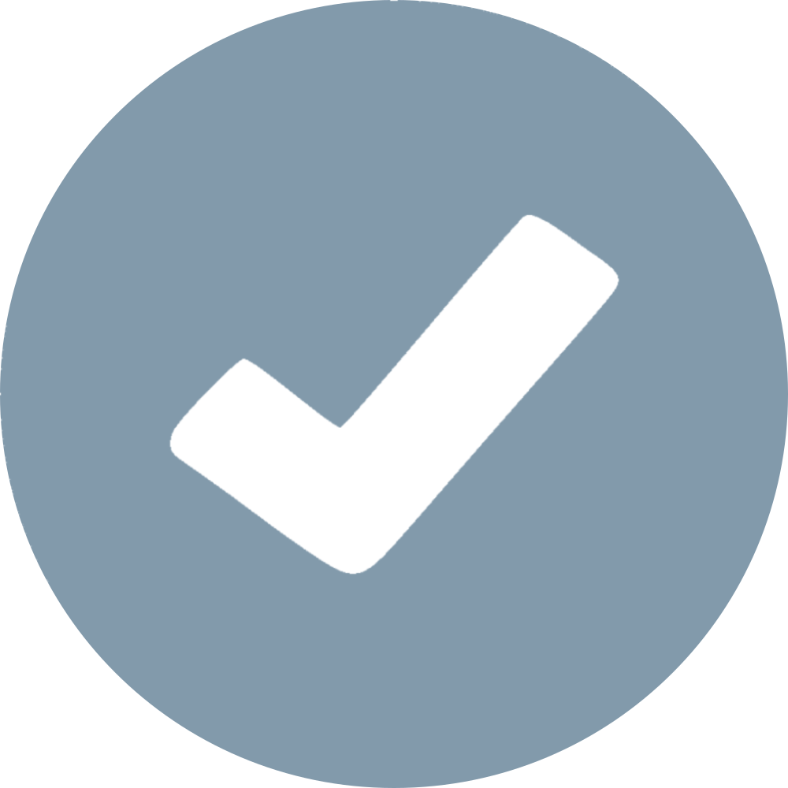

import BadgeWrapper from "@site/src/components/BadgeWrapper";

# Verification

Verification is a feature that is intended to help users identify notable accounts, business accounts, tester accounts, and official accounts.

## Checkmarks

<BadgeWrapper selected="Instance Variation" />

There are different checkmarks that are available on Nexirift accounts:

|  |  |  |  |
| ---------------- | ----------------- | --------------- | ----------------- |
| Notable          | Business          | Tester          | Official          |

## Rules

<BadgeWrapper selected="Specific to Nexirift" />

Verified accounts are required to follow the following rules on the official Nexirift instance:

- They must follow our general rules: Terms of Service.
- Must not promote targeted harassment against other accounts or groups.
  - Including but not limited to: gender, race, sexual orientation, religion, disability, age, nationality, and other protected categories.
- Must not abuse the power of their specific checkmark.
- Must not share their account as stated within our Terms of Service.
  - Organisations can use the built-in account share feature.
